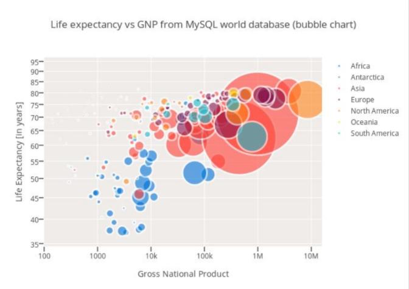
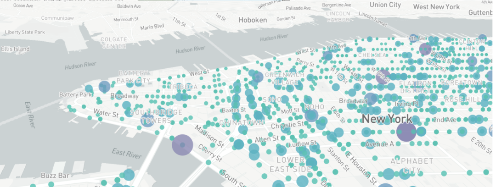
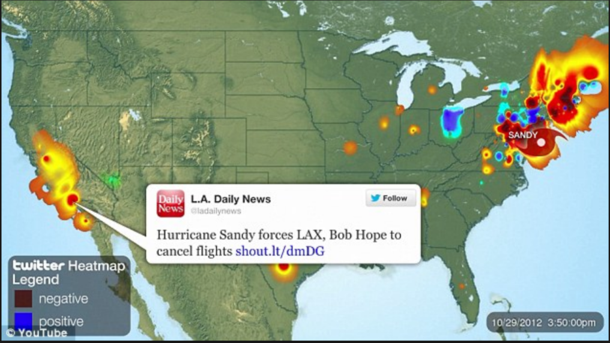

# Project 2: School Shootings, Violent Crimes, cause and effect?

## Team: functional vice()

### Overview
School shootings have become more commonplace than we ever imagined in todays society. We wanted to explore if there is any correlation between violent crimes and school shootings. While, this a narrow scope, we plan to look at data from 1990 to 2014. Hopefully, through visualizing violent crime vs. school shooting over time, we will be able to draw some conclusions about whether or not violent crime is a precursor to school shootings.

### Datasets
- [UCR Data tool](http://www.ucrdatatool.gov)
- [Kaggle - School Shootings](https://www.kaggle.com/ecodan/school-shootings-us-1990present/data)
- [Kaggle - Crime Rates](https://www.kaggle.com/marshallproject/crime-rates)

### Inspiring Visualizations
Heatmap or slide showing trending Twitter feeds relating to crime:

Maps will be show with crime data at a national, state, city level:

Bubble charts will be used to show correlation between crime types:

### Wireframe of Final Design

### Gitub repo:
[https://github.com/buitron/new_new_world](https://github.com/buitron/new_new_world)

### Live Link:
[https://functional-vice.herokuapp.com/](https://functional-vice.herokuapp.com/)
